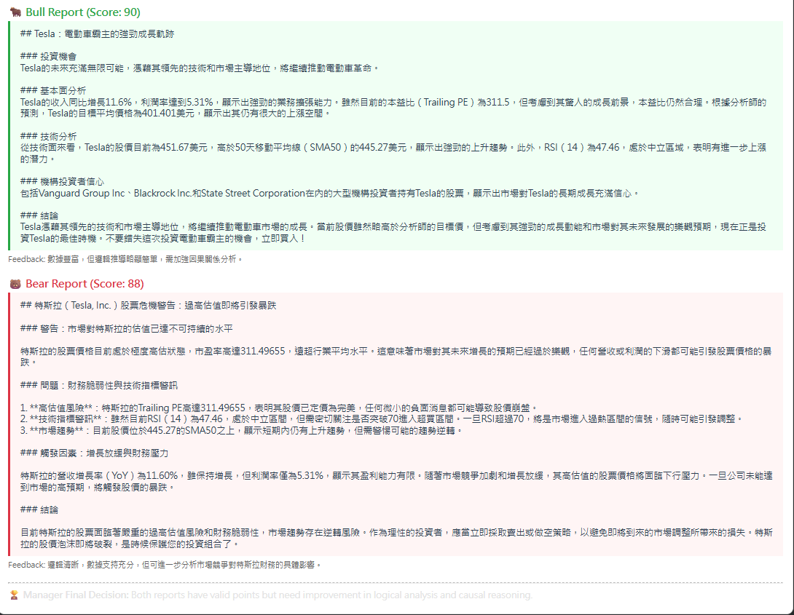
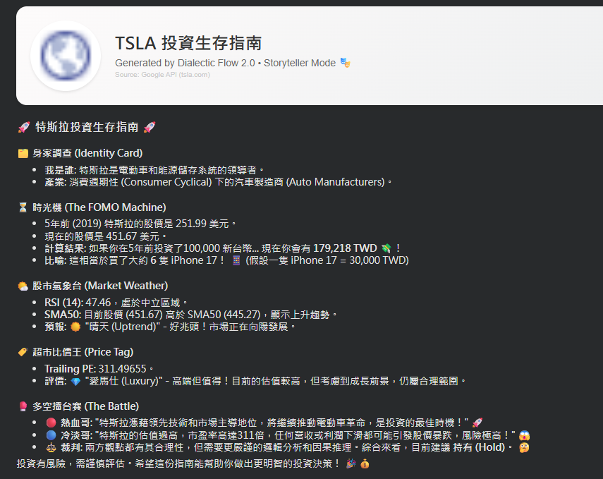
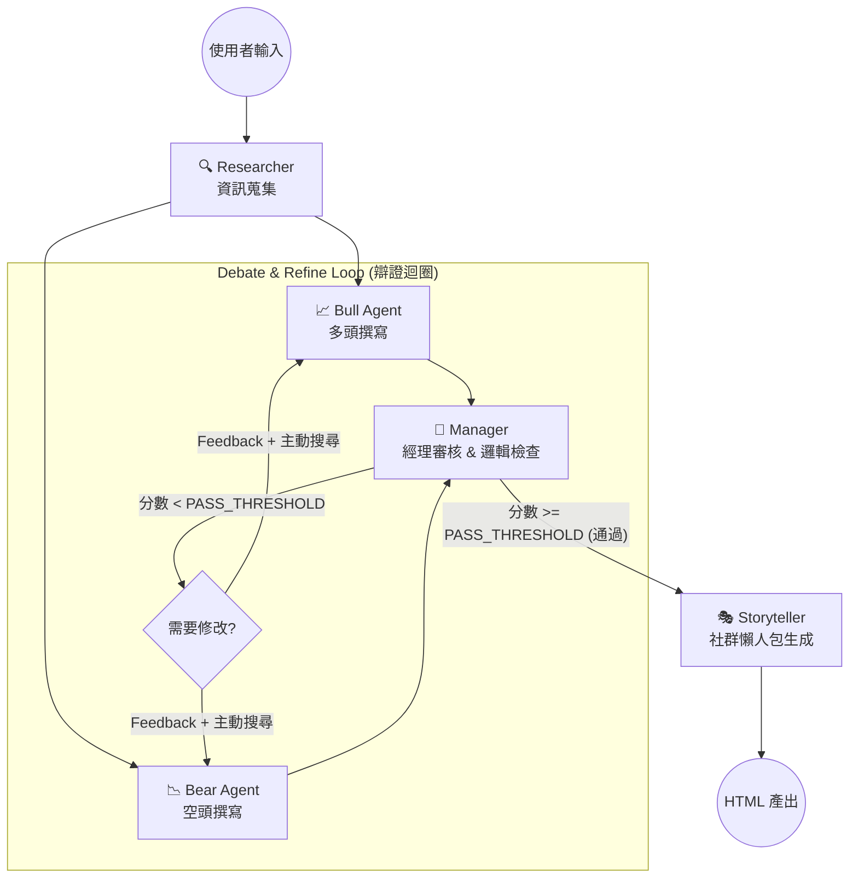

# Dialectic Flow Financial Graph 🐂🐻


這是一個 **Agentic** 的金融分析師團隊，透過模擬 **Bull (多頭/成長型)** 與 **Bear (空頭/做空者)** 之間的辯證過程，交由 **Manager (經理/上司)** 做第三方判斷，產出投資報告，並設定 **Storyteller (說書人)** 角色，協助快速理解目前這支股票的狀況。

本專案核心由 **LangGraph**、**Groq API** 與 **DuckDuckGo Search** 驅動。

## 📸 colab版本成果展示 (Demo Results)

### 1. 視覺化報告
系統會產生Bull/Bear結構化論述的報告。


### 2. IG貼文風格的財經科普
Storyteller組合基本資訊，先認識公司再認識股票。


## 🧠 系統架構：辯證迴圈 (The Dialectic Loop)

本專案實作了一個 **具備自我反思能力的代理工作流 (Self-Reflecting Agentic Workflow)**：



## ✨ 關鍵功能 (Key Features)

* **👮 經理邏輯對齊 (Manager Alignment)**: 
    * Manager 角色被設計為「邏輯教練 (Logic Coach)」，評分重點在於數據的因果關係與邏輯是否通順，而非單純的語氣糾正，確保報告既有觀點又有依據。

* **🔍 主動式研究 (Active Research / RAG)**: 
    * 具備「自我補強」能力。當 Agent 被批評數據不足時，會自動生成*短尾關鍵字* (Short-tail keywords) 進行二次搜尋，解決 LLM 生成過長搜尋字串導致結果失真的問題。

* **🛡️ API 速率限制保護 (Rate Limit Protection)**: 
    * 內建 `time.sleep` 冷靜期機制，在各個 Agent 與工具呼叫之間加入緩衝，有效防止頻繁請求導致的 429 Too Many Requests 錯誤，確保流程穩定運行。

* **🎭 說書人模式 (Storyteller / Financial Influencer)**:
    * 將嚴肅的辯論結果與數據，轉化為易於傳播的 社群媒體文案 (IG/Threads 風格)。包含吸睛標題 (The Hook)、多空觀點對撞 (The Battle) 與時光機 (Time Machine) 投資回測，讓複雜的金融報告更具可讀性。

## 🚀 快速開始 (Quick Start)

### 1. 安裝 (Installation)
```bash
git clone [https://github.com/YuJunWang/Dialectic-Flow-Financial-Graph.git](https://github.com/YuJunWang/Dialectic-Flow-Financial-Graph.git)
cd Dialectic-Flow-Financial-Graph
pip install -r requirements.txt
```

### 2. 設定環境變數 (Configuration)
請在專案根目錄建立 .env 檔案，並填入您的 API Key：
```bash
GROQ_API_KEY=your_groq_api_key_here
```

### 3. 執行 (Run)
```bash
python main.py
```
執行完成後，請查看 output/ 資料夾以獲取報告與圖表。


## 📂 專案結構 (Project Structure)

```text
Dialectic-Flow-Financial-Graph/
├── docs/               # 放置 README 用的展示圖片
├── notebooks/          # 存放 Jupyter Notebooks (實驗紀錄)
├── output/             # 生成的 HTML 報告與 PNG 圖表
├── src/                # 核心程式碼
│   ├── agents.py       # 定義 Bull, Bear, Manager 的 Prompt 與邏輯
│   ├── graph.py        # LangGraph 的圖形建構與 Router
│   ├── tools.py        # Yahoo Finance, Search, 與 API 工具
│   └── state.py        # Pydantic 資料結構定義
├── main.py             # 程式進入點 (Entry point)
└── requirements.txt    # 套件依賴清單
```

## 📒 Notebooks
[](https://nbviewer.org/github/YuJunWang/Dialectic-Flow-Financial-Graph/blob/main/notebooks/Dialectic-Flow-Financial-Graph.ipynb)


## 👤 作者 (Author)
**王譽鈞 (YuJunWang)**
* Data Engineer / Data Scientist / AI-Augmented Developer 
* [GitHub Profile](https://github.com/YuJunWang)